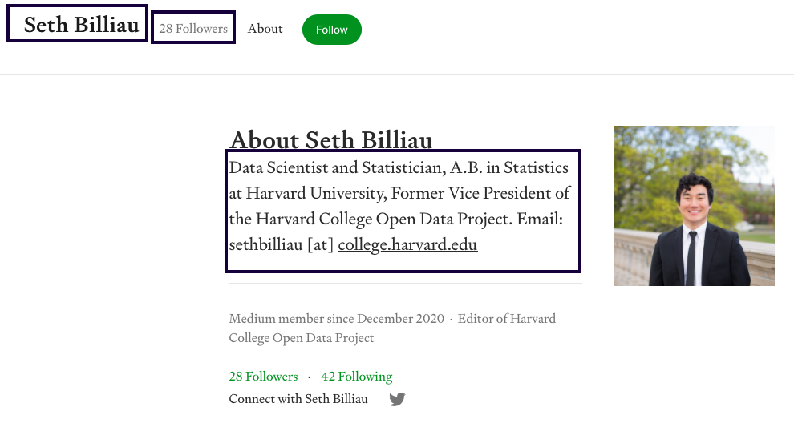

# Web scraping user profiles from TowardsDataScience
I web scrapped user profiles from the [stories dataset](https://github.com/xxionias/webscraping/tree/master/mediumstories) containing ~40000 user profiles links and generated 3908 unique user profile records.

## Initiate the Scrapy 
```
mkdir mediumprofile
cd mediumprofile
scrapy startproject mediumprofile
scrapy genspider profile [url]
```

Add ```FEED_EXPORT_ENCODING = 'utf-8'``` in `settings.py`

Generate the output by 
```scrapy crawl profile -o profile.json```

##


Sample Record :
```
{"user_name": "Luuk Derksen", "desc": "Co-founder / CTO of @orbiit_ai. Data (Scientist) junky. All views my own.", "followers": "691 Followers"}
```
