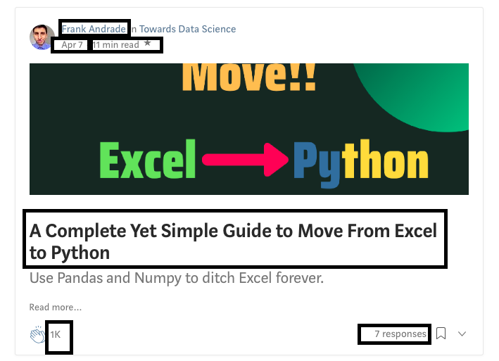

# Web scraping articles info from TowardsDataScience
I web scrapped 16529 articles' info from [TowardsDataScience](http://towardsdatascience.com) that published from 02/2016 to 05/2021

## Initiate the Scrapy 
```
mkdir mediumstories
cd mediumstories
scrapy startproject mediumstories
scrapy genspider stories [url]
```

Add ```FEED_EXPORT_ENCODING = 'utf-8'``` in `settings.py`

Generate the output by 
```scrapy crawl sories -o stories.json```

##


Sample Output Record :
```
{"author": "Luuk Derksen", "linkOfAuthorProfile": "https://towardsdatascience.com/@luckylwk?source=collection_archive---------0-----------------------", "articleTitle": "Visualising high-dimensional datasets using PCA and t-SNE in Python", "articleLink": "https://towardsdatascience.com/visualising-high-dimensional-datasets-using-pca-and-t-sne-in-python-8ef87e7915b?source=collection_archive---------0-----------------------", "postingTime": "Oct 29, 2016", "minToRead": "10 min read", "recommendations": "5.4K", "responses": "23 responses"}

```
